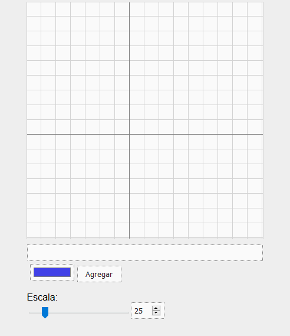

# Graficar

[ONLINE DEMO](https://mauroc8.github.io/graficar/)

Dibujar funciones 2D con javascript. Funciona en celulares.

## Desarrollo

¿Cómo puedo graficar rápidamente una función cualquiera? Si yo tengo una función y calculo su derivada, ¿puedo dibujar a ambas en el mismo gráfico para compararlas y verificar visualmente si hice bien los cálculos? De estas preguntas surgió el desarrollo de esta página web, allá por el 2016. A pesar de ser sumamente simple, fue de inmensa utilidad a lo largo de los años cuando estudiaba materias relacionadas con el cálculo y análisis de funciones.

Escrito en Javascript vainilla (sin frameworks ni librerías). Puede _parsear_ (leer y entender) expresiones matemáticas (usa un parser tipo _recursive-descent_ usando una técnica _ad-hoc_ para aplicar precedencia).

Las funciones se grafican uniendo puntos, obtenidos de evaluar la expresión para diferentes valores de `x`. Este enfoque _naive_ produce gráficos inexactos y con algunos errores fáciles de ver (por ejemplo, `tan(x)` dibuja una línea en las asíntotas, donde debería estar vacío).

## Uso

En el input, escribir el contenido de la función. Usar 'x' como variable independiente. Ejemplo:

    x + 2

Va a dibujar la función definida por la fórmula y = x + 2

## Sintaxis

`x^2`: potencia (x²)

`x/2`: división

`2*x`: multiplicación

`x + 2`: suma

`x - 2`: resta

`sin(x)`: seno

`cos(x)`: coseno

`tan(x)`: tangente

`|(x)|`: valor absoluto

Nota: Hay un bug que hace que haga falta ponerle paréntesis al valor absoluto. Igual cuando dividimos por `x`, hay que hacerlo así: `1 / (x)`. El bug se solucionará _quizás eventualmente_.
